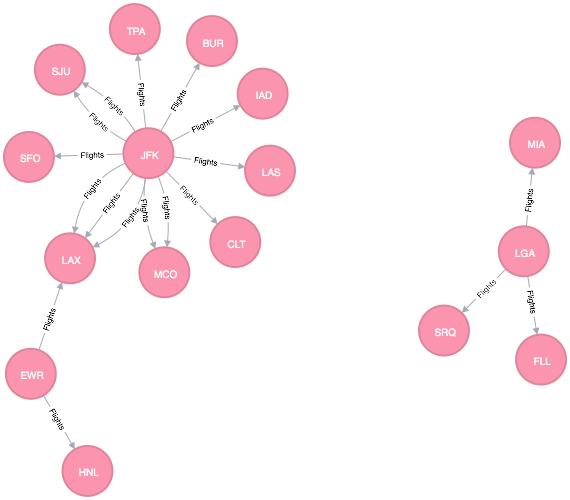

```{r setup, include=FALSE}
knitr::opts_chunk$set(echo = TRUE)
```

#Load the Flights Database
All NYC flights from 2013 are inclduded in a table called ```flights``` from the ```dplyr``` package.

```{r}
library(nycflights13)
library(dplyr)
glimpse(flights)
```

#Normalize the flights database
We will create a small relational database using a subset of the flights data.

```{r, message=FALSE}
remove(flights)

library(nycflights13)
library(dplyr)
library(tidyr)
glimpse(flights)

flights_raw <- flights

airports <- flights_raw %>% 
  select(origin, dest) %>% 
  gather(value = "airportCode") %>% 
  select(airportCode) %>% 
  distinct() %>% 
  arrange(airportCode) %>% 
  mutate(airportID = row_number()) %>% 
  glimpse()

flights <- flights_raw %>% 
  select(origin, dest, flight, carrier) %>% 
  group_by(origin, dest, flight, carrier) %>%
  summarize(count = n()) %>% 
  arrange(desc(count)) %>% 
  glimpse()

```

#Visualize the data as a graph using igraph
Now we have two tables. We can visualize the airports as nodes and scheduled flights as relationships between them.

```{r}
library(igraph)

g <- graph_from_data_frame(flights, directed=TRUE, vertices=airports)
plot.igraph(g)
```

This graph is impossible to read! To get a smaller sense, let's look at a smaller subset of the airports, such as just flights that are scheduled at least once a day.

```{r}
daily_flights <- flights %>% filter(count >=365)
eids <- daily_flights$flight
plot(subgraph.edges(g, eids, delete.vertices = TRUE), width = 10)
```

#Connect to Neo4J
##Get Started
RNeo4J is not yet available on CRAN. Install from the developer's Git Hub site using devtools:

```
install.packages("devtools")
devtools::install_github("nicolewhite/RNeo4j")
```

Once installed, load using the ```library``` function, as you would with any other package.
```{r, results='hide', message=FALSE}
library(RNeo4j)
```

This connection is through an Amazon Web Server virtual Ubuntu machine. This was done to avoid configuration issues using a Mac, and to ensure reproducibility. For a fuller explanation on how to configure an Amazon Web Serives virtual machine, see <a href="https://timhagmann.com/html/e63/hw2-hagmann-tim.html#appendix:_neo4j_setup" target="_blank">https://timhagmann.com/html/e63/hw2-hagmann-tim.html#appendix:_neo4j_setup</a>

```{r}
graph <- startGraph(
  #This links to my virtual machine
  url = "http://ec2-18-212-155-38.compute-1.amazonaws.com:7474/db/data/", 
  username = "neo4j", 
  password = "neopw", 
  #this option will give you back R in case you write a bad query by timing out after 2 seconds
  opts = list(timeout=2))
```


#Build the NoSQL Database in Neo4J
Once again, we will simplify our analysis by using only those flights which occur at least 365 times (most likley daily flights, which we have stored as ```daily_flights```).
```{r, cache = TRUE}
clear(graph, input = F)

addConstraint(graph, "airports", "airportCode")
addConstraint(graph, "flights", "flight")

for(i in 1:length(daily_flights$flight)){
  origin = getOrCreateNode(graph, "airports", airportCode = daily_flights[i,]$origin)
  dest = getOrCreateNode(graph, "airports", airportCode = daily_flights[i,]$dest)
  createRel(origin, "Flights", dest)
}

browse(graph)
```



#Conclusion
A relational database is very powerful, but it can be tricky to maintain joins across multiple types of relationships. For a very simple database, such as the one we have here, probably a relational database is easier to work with; however, we can imagine adding more kinds of data, for example more informaiton about the airports, or people who visit them, or carriers, where a relational database would quickly become overwhelmed--or at least overwhelming. For a data structure that may change frequently, or be heavily based on different types of relationships, a NoSQL database may be preferred.

#References

A good explanation of how to configure Neo4J to run on an Amazon Web Services Virtual Machine can be found here: <a href="https://timhagmann.com/html/e63/hw2-hagmann-tim.html#appendix:_neo4j_setup" target="_blank">https://timhagmann.com/html/e63/hw2-hagmann-tim.html#appendix:_neo4j_setup</a>

Code adapted and inspiration from data scientist Nicole White at <a href="https://nicolewhite.github.io/2014/05/30/demo-of-rneo4j-part1.html" target="_blank">her blog</a>.